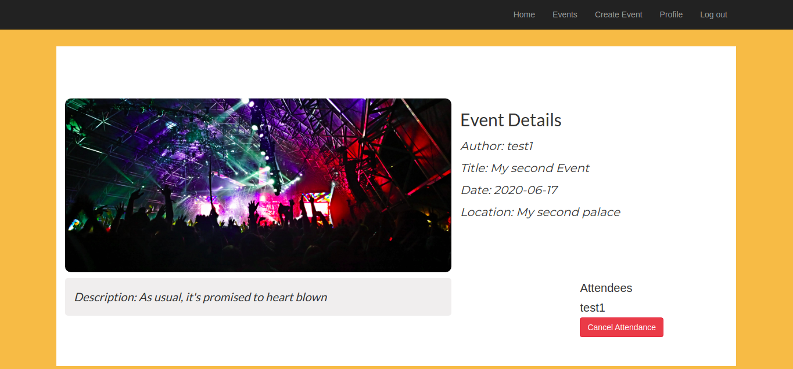

# 🔐 Private-Events - Rolling My Own Associations

This project is part of series of projects to be completed by students of [Microverse](https://www.microverse.org/).

In this project, I built a simple, exclusive site similar to a private <b><i>Eventbrite</i></b> which allows users to create events and then manage the users signups. Users can create events and send invitations and parties. A user can create events. A user can attend many events. An event can be attended by many usesrs.

***********

## 💻 Previews
Home Page
  
Signup Page
  
Login Page
  
Profile Page
  
Create Event Page
  
Event to Attend Page
  
Event to Cancel Page
  
Event Index Page
  

## 🎯 The Project Brief

The specifications and the guides to the project can be found on The Odin Project's [Project: Private Events](https://www.theodinproject.com/courses/ruby-on-rails/lessons/associations) page.

This project focuses heavily on testing our understanding of associations on web apps. Specifically, in this project we are given the task to build a site where users can create events, invite other users to an events and where an event can be attended by many users. The ability to create associations among those objects is the main focus of the project.

The associations systems implemented into this project include:
  - User authentication - Password encryption and password digest storage to avoid storing raw user passwords
  - Session for user authentication

## 🧰 Models Created

- User
- Event
- Attendance

## 🛠️ Built with

- Ruby 2.7.1
- Ruby on Rails 6.0.3
- Bootstrap 4.3.1
- Rubocop 0.83.0
- Stickler CI

## 📼 Setup & Usage

### Setup
In order to get this webpage up and running, you may have to do a little set up first.
  1. Make sure you have both [Ruby](https://www.ruby-lang.org/en/documentation/installation/) and Ruby on Rails ([Mac](https://gorails.com/setup/osx/10.15-catalina) • [Linux](https://gorails.com/setup/ubuntu/19.10) • [Windows](https://gorails.com/setup/windows/10)) installed.
  2. You can clone or download this repo! 
  
      `git clone git@github.com:Qoosim/Rails-Private_Events.git`

  3. `cd` into the root directory of the repo. [What does 'cd' mean?](https://www.macworld.com/article/2042378/master-the-command-line-navigating-files-and-folders.html)
  4. Run below command to get the gems that are needed for this project

        `bundle install --without production`

  5. Migrate the databse with the `rails db:migrate` in the terminal
  5. In your terminal window, enter `rails server` to start the server.
  6. Now navigate to [localhost:3000](localhost:3000) in your browser to start playing with the webpages!

## 🎉 Features

  * New Users can sign up with secure password
  * Users can log into the app
  * Not logged users can see the events at events_path
  * Logged users can create new events
  * Logged users can attend upcoming events
  * User profile shows upcoming and past events
  * Logged users already attending an event can cancel the attendance
  * User profile shows events created by the user

## 🧪 How to run test cases
  * Commands to run unit tests
    `rspec spec/controllers`, 
    `rspec spec/models`
  * Command to run integration tests
    `rspec spec/features`

## 🕹️ Contributions, Issues & Forking

If you have any issues setting up the project or you come across any unintended bugs or problems, please do submit an issue to the [Private Events](https://github.com/Qoosim/Rails-Private_Events/issues) page.

If you want to make your own changes, modifications or improvements to this project, go ahead and Fork it!
1. [Fork it](https://github.com/Qoosim/Rails-Private_Events/fork)
2. Create your working branch (git checkout -b [choose-a-name])
3. Commit your changes (git commit -am 'what this commit will fix/add/improve')
4. Push to the branch (git push origin [chosen-name])
5. Create a new Pull Request

## 👨🏽‍💻 Author
**Qoosim AbdulGhaniyy**

- Github: [@Qoosim](https://github.com/Qoosim)
- Twitter: [@qoosim_ayinde](https://twitter.com/qoosim_ayinde)
- Linkedin: [qoosim_abdulghaniyy](https://www.linkedin.com/in/qoosim-abdulghaniyy)

## 🧴 Show Your Support

Give a ⭐️ if you like this project!
